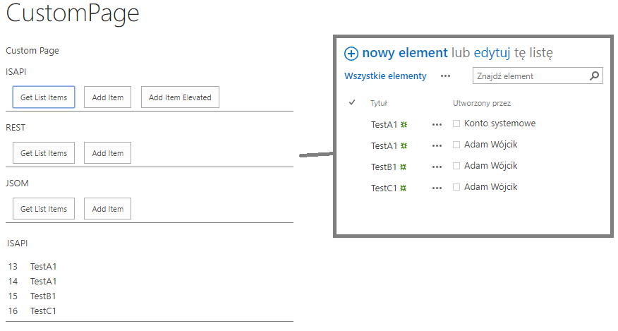

## ClientSideProject

#### Description

This solution contains two projects:
- FrontEnd - this project is a sandbox solution that adds a custom page to the site to pages library. The page uses different type of javascript approaches to get list items and to add an item. The javascript methods used are SharePoint OOT REST API and JSOM, but also custom REST API calls to custom ISAPI added to the farm. Different methods used are present in this helper js file:
https://github.com/Adam-it/SharePointOldSchool/blob/master/ClientSideProject/FrontEnd/Javascript/helpers.js
The methods that are used are REST Api (also to custom ISAPI) and JSOM.
- ISAPI - this is a farm project that adds custom WCF service (.svc) to the SharePoint Farm (ISAPI folder) which allows to get list items and adds items, also with possibility to add item with elevated permission which is not possible via OOTB REST API or JSOM.

This kind of SharePoint application approach is perfect for dev team that splits responsibilities between server side code and frontend. We may have one team responsible only for server side logic which may be accessed via SOAP or REST and other team which does only front side of the application which is based on aspx pages added to pages library, javascript and css stored in style library.

----
#### MSDN 

MSDN resource helpful to understand the used technology

https://docs.microsoft.com/en-us/sharepoint/dev/sp-add-ins/complete-basic-operations-using-javascript-library-code-in-sharepoint
https://docs.microsoft.com/en-us/sharepoint/dev/sp-add-ins/complete-basic-operations-using-sharepoint-rest-endpoints
https://docs.microsoft.com/en-us/sharepoint/dev/general-development/overview-of-the-sharepoint-page-model

---
#### Example

example of the solution to user REST, JOSM and custom ISAPI to get list items and add item to list

