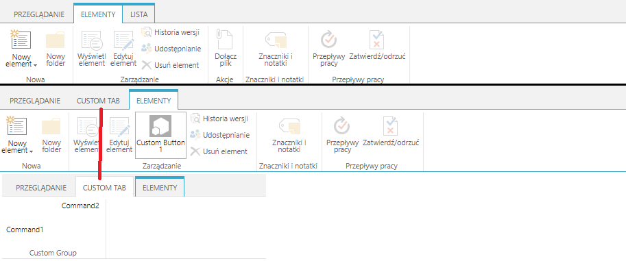
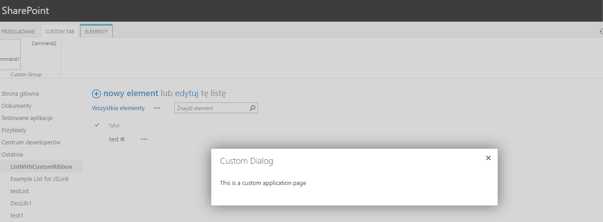

## CustomRibbonAndApplicationPage

#### Description

This solution contains two projects:
- ApplicationPage - This project adds image to the _layouts which is used as an image to ribbon button.
This project also adds custom Application Page to the Farm wich is then used in javascript SharePoint dialog. Application pages may always be oppened from any SharePoint location under _layouts url path. The application page may have any serwer side logic added 
- CustomRibbon - This project is a sandbox solution which adds custom masterpage, list and content type to site collection.
This project also adds custom javascript with functions used in ribbon buttons. One function presents an application page from _layouts in a SharePoint dialog after the user clicks on ribbon button.
Finally this solution modifies Ribbon for a specified content type added to a list. The used ribbon modifications are:
-List tab is hidden 
-ListItem action group is hidden
-Custom button added to existing group
-New tab added with new group and two new buttons

----
#### MSDN 

MSDN resource helpful to understand the used technology
https://docs.microsoft.com/en-us/visualstudio/sharepoint/creating-application-pages-for-sharepoint?view=vs-2019
https://docs.microsoft.com/en-us/sharepoint/dev/solution-guidance/add-a-custom-ribbon-to-your-sharepoint-site
https://docs.microsoft.com/en-us/sharepoint/dev/general-development/how-to-apply-a-master-page-to-a-site-in-sharepoint

---
#### Example

this image presents the changes made to the OOTB list ribbon which is present only when the content type is added to the list 

this image present a cutom application page shown in javascript SharePoint dialog after the user clicks on the ribbon button. This application page may store any kind of form or other page which is supported with server side code

