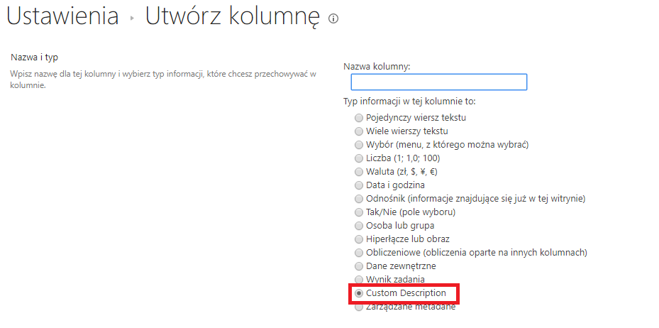

## CustomFieldType

This project adds custom filed (column) to SharePoint. This kind of column may be used in custom list. 
- Custom.ValidationRule.cs - provides custom validation for the field (a very simple one.. just as an example)
- CustomFieldControl.ascx - provides custom UI for the field

## MSDN

[Link to docs](https://docs.microsoft.com/en-us/previous-versions/office/developer/sharepoint-2010/gg132914(v%3doffice.14))

## Example

When adding column to list new column is visible as one of the options

When no value is provided then the field is populated with default value
<pre>
if (this.ControlMode == SPControlMode.New)
{
    textBox.Text = "some sample text";
}
</pre>

The field has custom validation 

