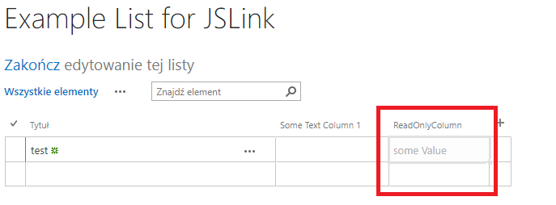
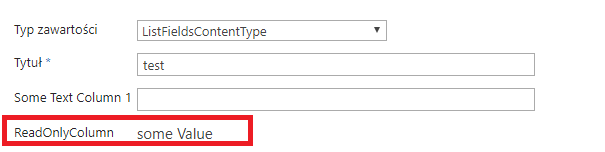
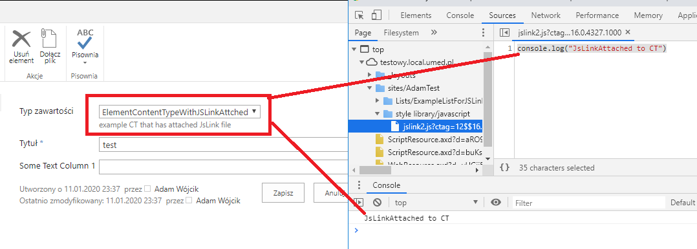

## JSLinks

#### Description

This project adds list with a field (column) that has JsLink file attached to it. 
The list also has a content type that has an attached JsLink file to the content type. 
The JsLink files are deployed to Style Library in the site collection. JsLink1 makes the filed readonly in edit form and in quick edit mode of the list (the new form is commented out). The second JsLink just produces a simple console.log to see that it is present when the item has the correct content type

----
#### MSDN 

MSDN resource helpful to understand the used technology

https://docs.microsoft.com/en-us/archive/msdn-magazine/2014/june/sharepoint-using-jslink-with-sharepoint-2013

---
#### Example

JsLink1 makes the field readonly in quick edit mode of list

JsLink1 makes the field readonly in edit form

JsLink2 present when correct content types is selected for the item

