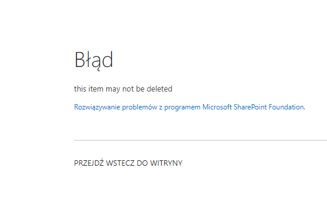
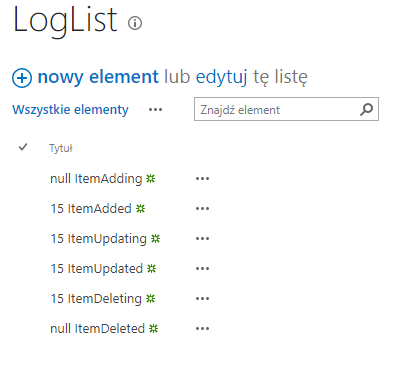

## EventReceivers

- EventReceiver - this project adds list item event receiver to custom list
- SharedLogic - this project has helper classes that will be shared between projects in this solution (other event receivers)
- SharePointSharedLibrary - is to include and deploy SharedLogic c# library to GAC
- Scripts - store helper PS1 scripts

## Example

When some validation is not met then the event receiver cancels deletion of item

How some of the events are logged in a custom list by the event receiver

