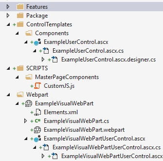
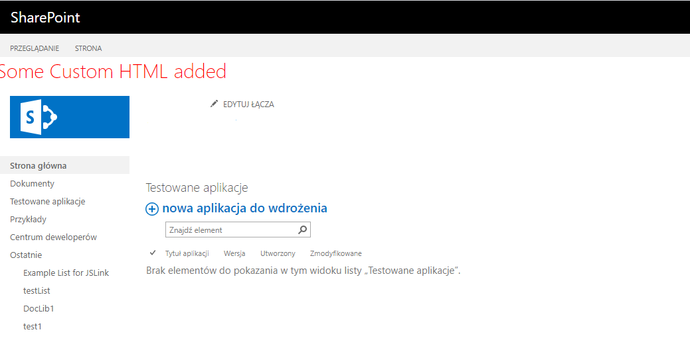

## MasterPage

#### Description

This solution contains two projects:
- Components - this is a farm solution that adds a UserControl, WebPart, js file (css could be added the same way) to SharePoint which are then added and used in the MasterPage. The UserControl is also added and used in the WebPart. This project presents different item types to implement custom components (elements) which may be added in different SharePoint places. UserControls are perfect to implement reusable functionality which may be then used in many other SharePoint projects like MasterPage or WebParts. WebParts are perfect to implement a bit bigger functionalities (that may be composed from many UserControls). WebPart may be added directly to a SharePoint page or also added declaratively to MasterPage. SharePoint PowerUsers may also add WebParts and use them when editing page content. 
- MasterPage - This solution adds a custom MasterPage to site collection. This is a great starting point to add more customization to the site and customize the look and feel of SharePoint site. MasterPage is the top and most important level of site customization.

----
#### MSDN 

MSDN resource helpful to understand the used technology

https://docs.microsoft.com/en-us/sharepoint/dev/general-development/how-to-apply-a-master-page-to-a-site-in-sharepoint

https://docs.microsoft.com/en-us/visualstudio/sharepoint/how-to-create-a-user-control-for-a-sharepoint-application-page-or-web-part?view=vs-2019

https://docs.microsoft.com/en-us/visualstudio/sharepoint/creating-web-parts-for-sharepoint?view=vs-2019

---
#### Example

Components present in the project (usercontrol, webpart, js file (also css could be added the same way)) added to MasterPage

Changes visible in a custom MasterPage with WebPart and UserControl present added to the masterpage

