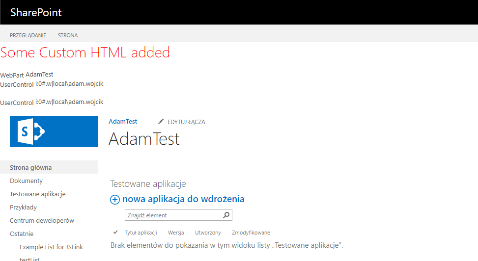

## MasterPage

- Components - this is a farm solution that adds a usercontrol, webpart, js file (css could be added the same way) to SharePoint which are then added and used in the masterpage. 
The usercontrol is also used in the webpart
- MasterPage - This solution adds a custom MasterPage to site collection. This is a great starting point to add more customization to the site and customize the look and feel.

## Example

Components present in the project (usercontrol, webpart, js file (also css could be added the same way)) added to masterpage

Changes visible in a custom MasterPage with webpart and user controle present added to the masterpage

