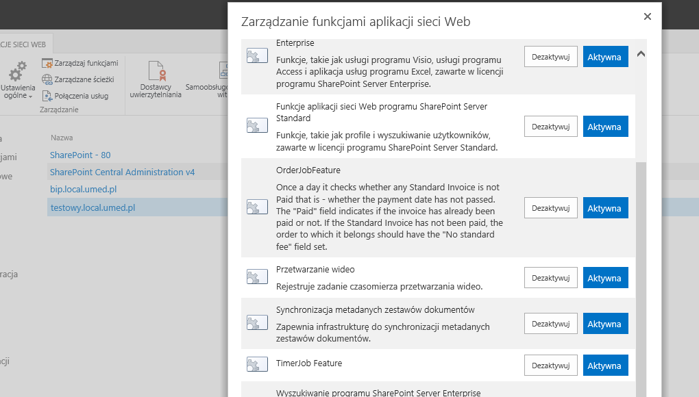
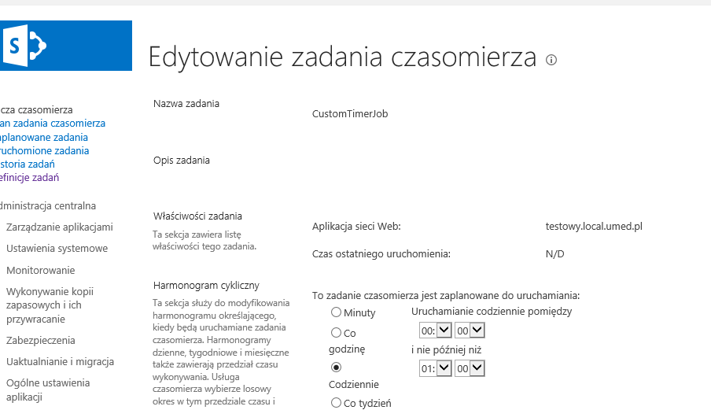
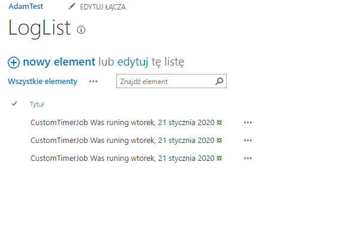

## TimerJob

- TimerJob - this project adds custom timer job to web application that runs every hour and adds some items to list on sitecollections from this web application that have a defined property bag set on web
- Scripts - store helper PS1 scripts

## Example

feature on web application level that adds timer job on active and removes on deactive

timer job defenition in CA

result of the timer job - items added to list

