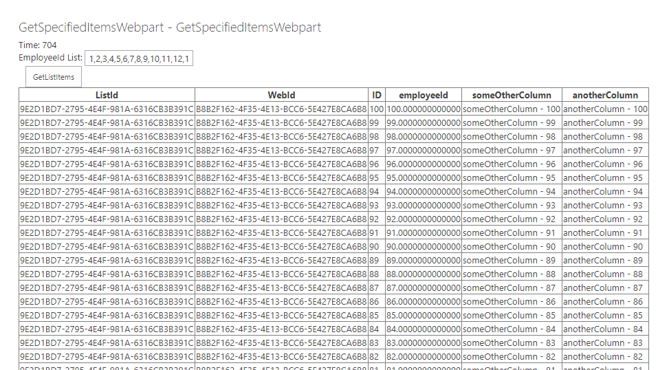

## GetSpecifiedItems

This is an example case that shows how to query items based on many conditions in one column using <in> tag with caching when list is over 5000 item threshold
There is a PowerShell script \Scripts\CreateListAndAddItems.ps1 that adds needed architecture for this example. It add list with indexed columns and over 5000 items
The sample webpart uses standard caching approach to retrieve items from list using CAML Query

## Example

powershell script execution

webpart result that retrieves 100 items from list of 5300 items (less then 1s response)

