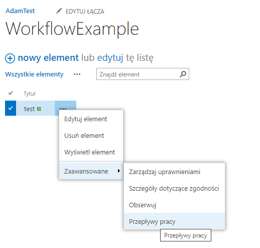
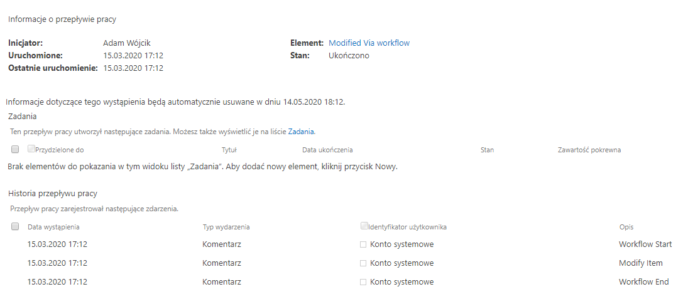

## Workflow

#### Description

This is an example of a very simple workflow made in SharePoint designer. This kind of project is one of the best approaches for a NoCode PowerUser in order to implement custom flow logic with many business process functionalities to use them in lists or libraries. This kind of workflow is a reusable workflow which may be exported and imported as wsp files to any Site.

----
#### MSDN 

MSDN resource helpful to understand the used technology

https://docs.microsoft.com/en-us/sharepoint/dev/general-development/workflows-in-sharepoint

---
#### Example

configure workflow - add it to list

menu option to start workflow

button to start workflow

workflow history 

workflow status and efekt

